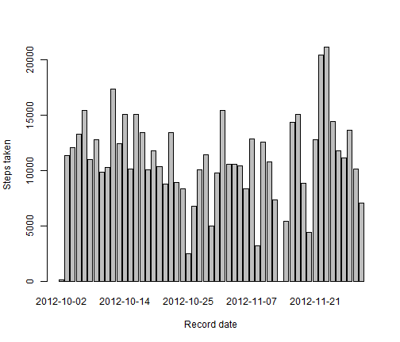
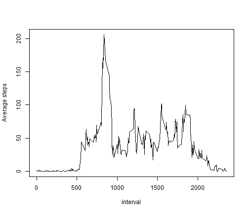
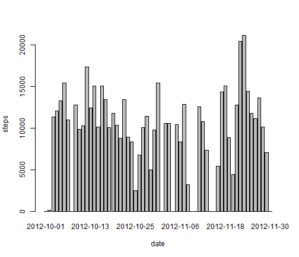
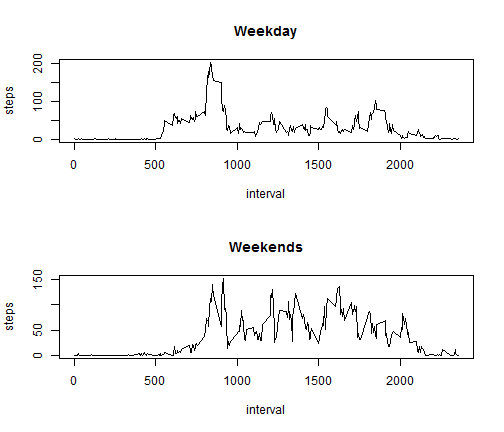

Reproducible Research: Peer Assessment 1
========================================================
*by Ajay Kumar*

**Loading & preprocessing the data from default Github repo folder cloned on my desktop**


```r
setwd("D:\\COursera\\RepData_PeerAssessment1")
unzip("activity.zip")
activity <- read.csv("activity.csv")
activity$date<-as.Date(activity$date)

Steps_taken_each_day <-aggregate(steps~date, data = activity,FUN = sum, na.rm=TRUE)
Avg_Steps_taken_each_interval <-aggregate(steps~interval, data = activity,FUN = mean, na.rm=TRUE)
```

**What is mean total number of steps taken per day?**

Histogram of the total number of steps taken each day


```r
barplot(Steps_taken_each_day$steps, names.arg =Steps_taken_each_day$date , xlab = "Record date", ylab = "Steps taken")
```

 

Mean total number of steps taken per day

```r
mean(Steps_taken_each_day$steps)
```

```
## [1] 10766.19
```

Median total number of steps taken per day

```r
median(Steps_taken_each_day$steps)
```

```
## [1] 10765
```

**What is the average daily activity pattern?**

Made a time series plot (i.e. type = "l") of the 5-minute interval (x-axis) and the average number of steps taken, averaged across all days (y-axis)


```r
plot(Avg_Steps_taken_each_interval, type = "l",ylab="Average steps")
```

 

Which 5-minute interval, on average across all the days in the dataset, contains the maximum number of steps?

```r
max_1<-max(Avg_Steps_taken_each_interval$steps)
Avg_Steps_taken_each_interval[Avg_Steps_taken_each_interval$steps==max_1,]$interval
```

```
## [1] 835
```

**Imputing missing values**

The total number of missing values in the dataset (i.e. the total number of rows with NAs)

```r
nrow(activity)-nrow(activity[complete.cases(activity),])
```

```
## [1] 2304
```

Imputing missing values with zero. It is most likely that the person with activity monitoring was inactive(taking rest) during NA measurement.Created a new dataset that is equal to the original dataset but with the missing data filled in.

```r
activity2<-activity
steps_isNA<-is.na(activity2$steps)
activity2$steps[steps_isNA]<-0
Steps_taken_each_day2<-aggregate(steps~date, data = activity2,FUN = sum, na.rm=TRUE)
```

Make a histogram of the total number of steps taken each day

```r
barplot(Steps_taken_each_day2$steps, names.arg = Steps_taken_each_day2$date, xlab = "date", ylab = "steps")
```

 

Calculate and report the mean and median total number of steps taken per day. Do these values differ from the estimates from the first part of the assignment? What is the impact of imputing missing data on the estimates of the total daily number of steps?


```r
mean(Steps_taken_each_day2$steps)
```

```
## [1] 9354.23
```

```r
median(Steps_taken_each_day2$steps)
```

```
## [1] 10395
```

Both mean & median go down just a little bit.

**Are there differences in activity patterns between weekdays and weekends?**

Processing Day types 


```r
week_part<-weekdays(activity2$date)
activity2$week_day<-week_part
week_end<-ifelse(week_part %in% c("Saturday", "Sunday"),"Weekend","Weekday")
activity2$daytype <- as.factor(week_end)
```

Panel plot For Weekend/Weekday


```r
par(mfrow = c(2, 1))
weekdays_data <- aggregate(steps ~ interval, data = activity2, subset = activity2$daytype == "Weekday", FUN = mean)
plot(weekdays_data, type = "l", main = "Weekday")
weekends_data <- aggregate(steps ~ interval, data = activity2, subset = activity2$daytype == "Weekend", FUN = mean)
plot(weekends_data, type = "l", main = "Weekends")
```

 


*Weekend activity is more.*

